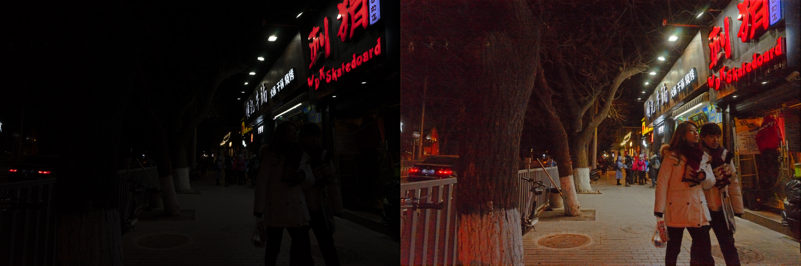
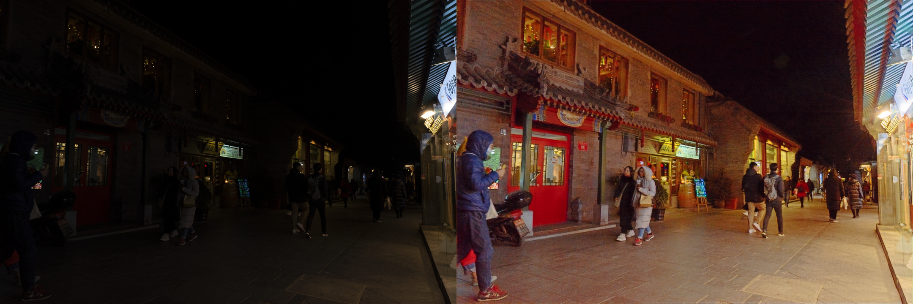
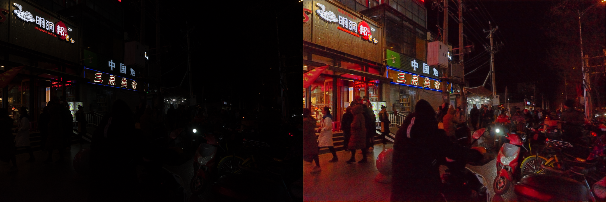

# Equilibrium Matching for Low-Light Image Enhancement

Equilibrium Matching (EqM+) applied to paired low-light/normal-light image data.

## Architecture

<p align="center">
  
</p>

## Usage

```bash
# Train
python -m src.train

# Evaluate
python -m src.eval
```

## Structure

```
src/
  train.py    Training loop
  eval.py     Inference & evaluation
  loss.py
  eqmnet.py   Architecture
datasets/
  paired_dataset.py    Dataset loader
```

## Output Examples

<p align="center">
  
  
</p>

<p align="center">
  
  
</p>
