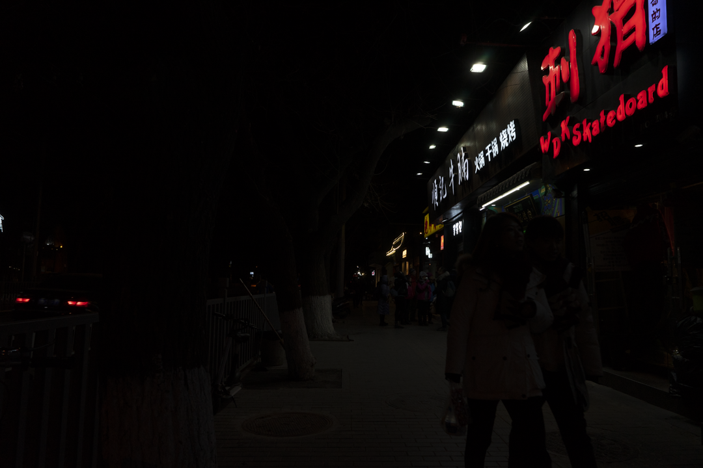
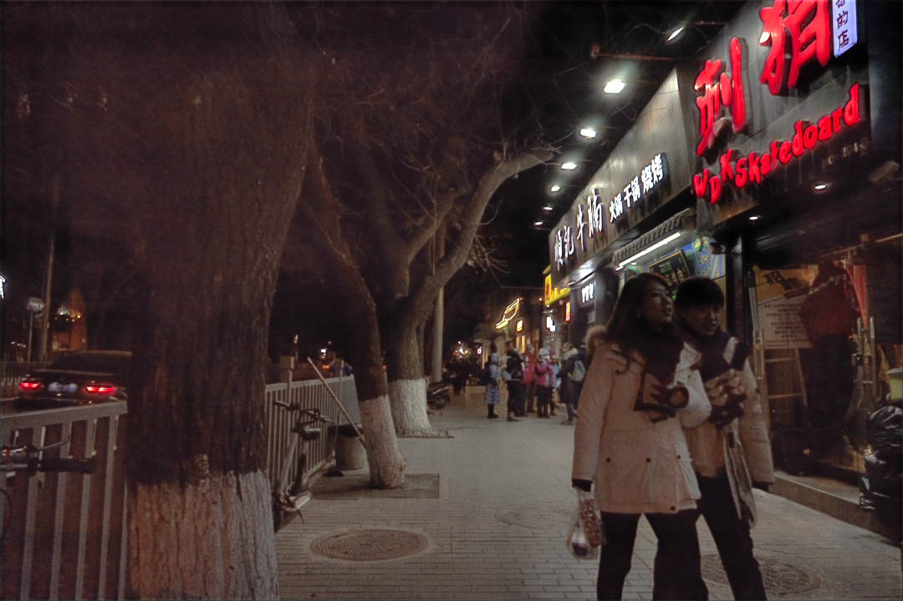
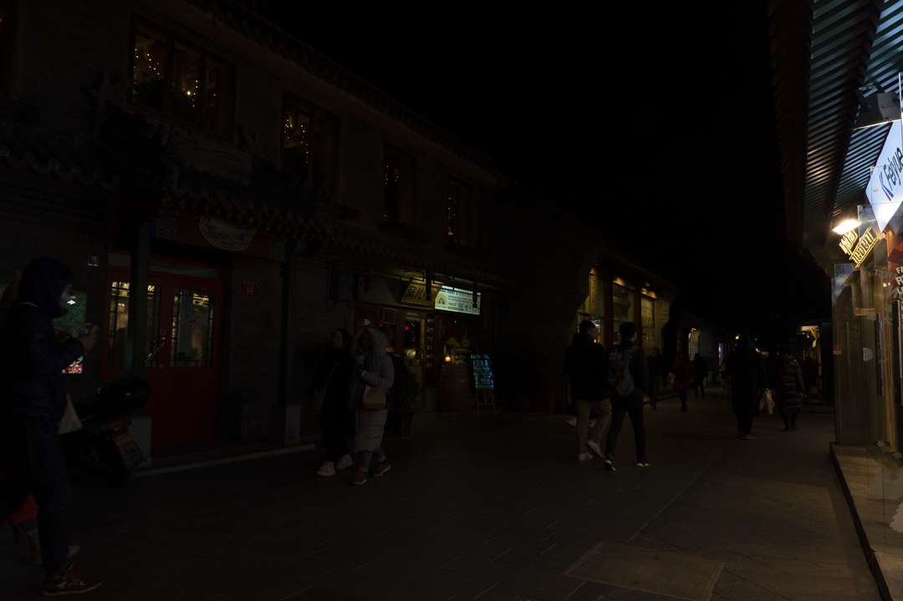
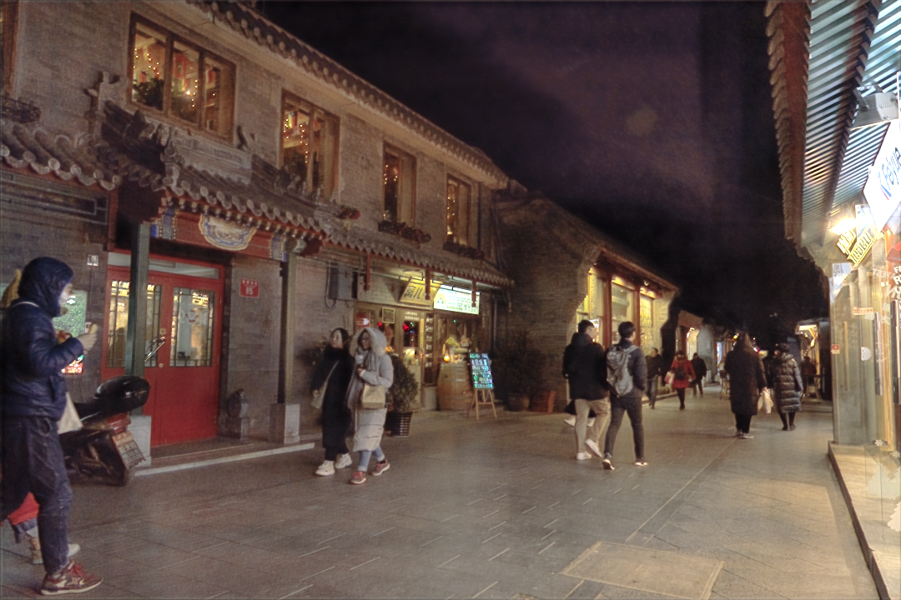

# Equilibrium Matching for Low-Light Image Enhancement

Equilibrium Matching (EqM) applied to paired low-light/normal-light image data, using a U-Net to learn the energy gradient field.
## Usage

```bash
# Train on LOL dataset
python -m src.train

# Evaluate 
python -m src.eval
```

## Structure

```
src/
  train.py    Training loop
  eval.py     Inference & evaluation
  loss.py    
  unet/       U-Net architecture 
datasets/
  paired_dataset.py   LOL dataset loader
```

## Output Examples

<p align="center">
  
  
</p>

<p align="center">
  
  
</p>
